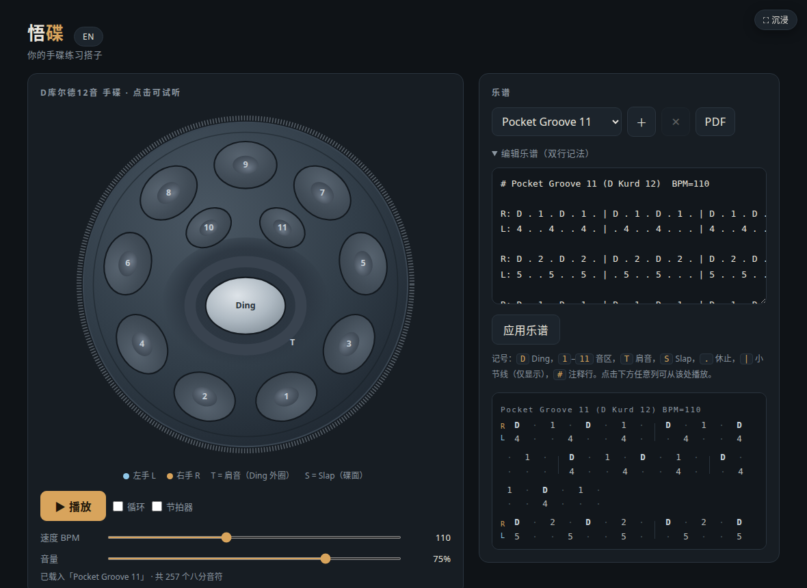
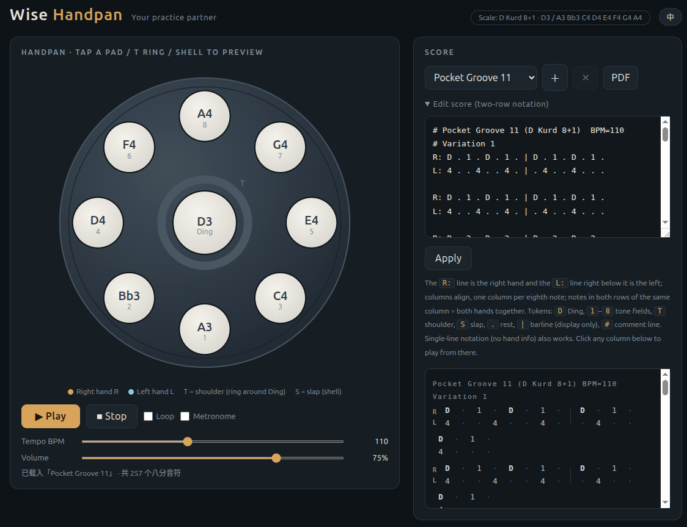

# 悟碟 · WisePan

[中文](#中文) | [English](#english)

## 中文

一个手碟的电子仿真软件：SVG 手碟可视化、三力度真实录音采样与 Web Audio 共鸣尾音。
支持从 PDF 导入并自动识别曲谱、乐谱可直接编辑修改、播放速度（BPM）可调、节拍器可开关。

### 在线体验

👉 https://www.wisehai.com/handpan-project/

在 iPhone/Android 上用 Safari/Chrome 打开后，可以"添加到主屏幕"，像原生 App 一样全屏使用（详见下方
PWA 部分）。

### 本地运行

录音采样需要通过 HTTP 加载。在项目目录运行 `python3 -m http.server 8000`，再打开
`http://localhost:8000/handpan-player.html`。直接双击 HTML 仍可运行，但会使用合成备用音色。

### 功能

- 手碟 SVG 可视化，支持点击/触摸敲击，也支持多指同时按住多个音（真实和弦手感）
- 播放 / 循环 / 节拍器
- 两行文本乐谱格式（R: 右手 / L: 左手），可直接编辑
- 从 PDF 识别乐谱（仅支持带真实文字层的矢量 PDF，扫描件/纯图形谱目前无法识别）

### PWA（添加到主屏幕）

已经内置 `manifest.webmanifest`、iOS 专属 meta 标签和 Service Worker，支持离线使用：打开上面的在线
地址，用浏览器的"添加到主屏幕"即可，之后从主屏幕图标启动会是全屏体验，不再显示浏览器地址栏。

### 打包成 Android APK

`android-app/` 目录是基于 Capacitor 的 Android 工程，具体的重新构建步骤见
[`android-app/README.md`](android-app/README.md)。

### 打包成 iOS App

`ios-app/` 目录同样是基于 Capacitor 的封装工程，但构建完全在 Codemagic 云端 macOS 机器上进行
（本地不需要 Mac/Xcode），流程见根目录 [`codemagic.yaml`](codemagic.yaml) 和
[`ios-app/README.md`](ios-app/README.md)。

### 已知限制

首次敲击会初始化并解码录音采样；较旧或内存紧张的设备上，第一次发声可能短暂使用合成备用音色。

### 项目结构与开发说明

给 AI 编程助手/开发者看的架构说明在 [`CLAUDE.md`](CLAUDE.md)。

## English

A handpan electronic simulator: SVG visualization, three recorded velocity layers, and Web Audio
resonance tails. Supports importing and auto-recognizing scores from
PDF, directly editable scores, adjustable playback speed (BPM), and a toggleable metronome.

### Try it online

👉 https://www.wisehai.com/handpan-project/

On iPhone/Android, open it in Safari/Chrome and "Add to Home Screen" to use it full-screen like a
native app (see the PWA section below).

### Run locally

Run `python3 -m http.server 8000` in the project directory, then open
`http://localhost:8000/handpan-player.html`. Opening the HTML as a `file://` page still works, but
uses the synthesis fallback because browsers do not allow it to fetch the recorded assets.

### Features

- SVG handpan visualization — click/tap to play, with true multi-touch chords (hold several notes
  at once, just like a real handpan)
- Play / Loop / Metronome
- Two-row text score format (R: right hand / L: left hand), directly editable
- Recognize scores from PDF (only vector PDFs with a real text layer — scanned or graphics-only
  scores aren't supported yet)

### PWA (Add to Home Screen)

Ships with a `manifest.webmanifest`, iOS-specific meta tags, and a service worker for offline use:
open the link above and use your browser's "Add to Home Screen"; launching from the home-screen
icon afterward runs full-screen, with no browser address bar.

### Package as an Android APK

`android-app/` is a Capacitor-based Android project; see
[`android-app/README.md`](android-app/README.md) for the rebuild steps.

### Package as an iOS App

`ios-app/` is likewise a Capacitor wrapper project, but the build runs entirely on Codemagic's
cloud macOS machines (no local Mac/Xcode needed) — see [`codemagic.yaml`](codemagic.yaml) and
[`ios-app/README.md`](ios-app/README.md) for the flow.

### Known limitations

The first tap initializes and decodes the recorded samples. On older or memory-constrained devices,
that first sound may briefly use the synthesis fallback.

### Project structure & dev notes

Architecture notes for AI coding assistants/developers are in [`CLAUDE.md`](CLAUDE.md).
